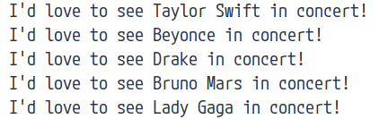
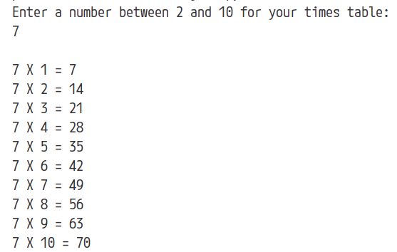

## Python FOR Loops (Evidence)

### Create Your GitHub Repo

- Create a new GitHub repo: *for-loops-evidence*
- Save your work to this repo
- **Bring your finished script up to your teacher today before you leave**

### Coding (Part 1)

- Create a list of at least three of your favorite artists/performers
- Use a `for` loop to print a sentence about each of your favorite performers

### Sample Output (Part 1)
 

### Coding (Part 2)

- Use a `for` loop and Python's `range( )` function to make a times table for a number between 2 and 10
  - Prompt the user for the number to use for the times table
  - Display the times table

### Sample Output (Part 2)
 
